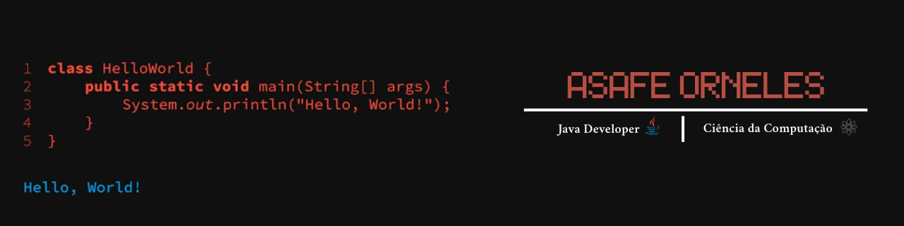

 

<h4>
  - Asafe Orneles  
  🎓 Cursando Ciência da Computação  
  ☕ Focado no desenvolvimento back end, Java  
  ✉ Contate - me no email: asafeorneles@gmail.com  
</h4>

 
   
   

---

### 🤖 Linguagens e Tecnologias
  
  
  
  

 
 

---

### 📊 Estatísticas

  

  

